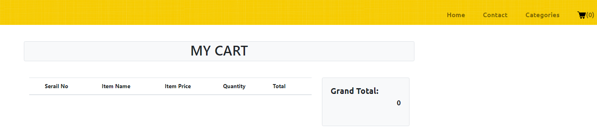

# M-Foods

### This is an **Online Food Delivery** Website for individual business purpose.

### Languages

> Frontend  

> Backend

## Navbar

## Categories Section

### contains all the menu  list

## Category items

### Contains different items of same category

## Cart before adding Items

## Cart after adding Items

## Admin Login page

## Admin Panel

### This contain information about the order like-name, phone number, address ,items ordered ,quantity, total amount.
